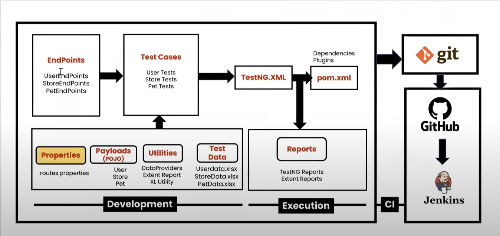
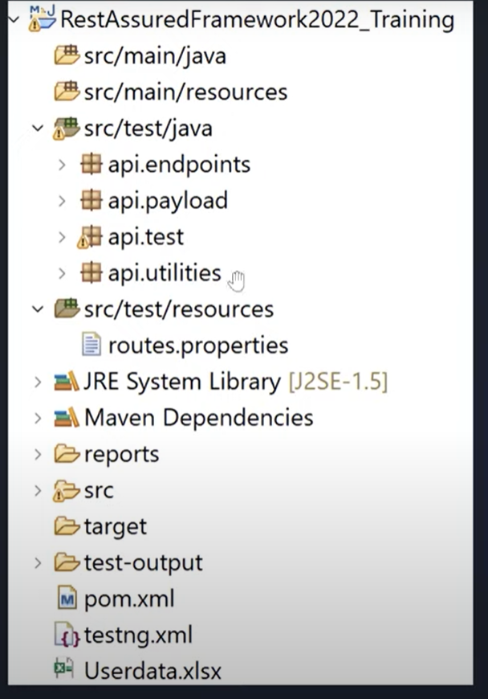
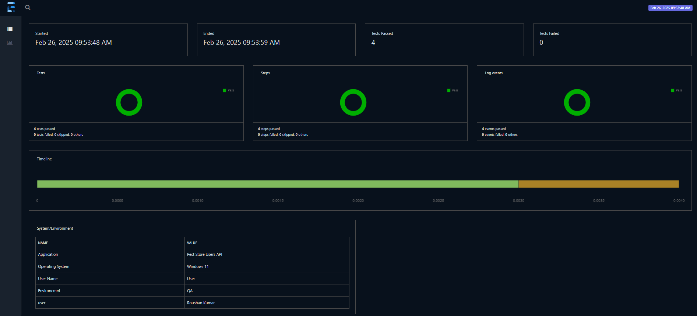
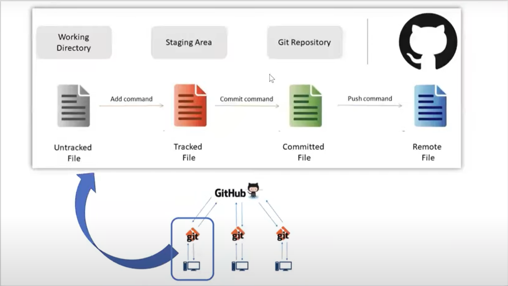

# API Automation Framework - Java | RestAssured | TestNG  
 
### Framework Design  
  

### Folder Structure 
  

### Test Report  
  

### Git 
  


## Overview  
This **API Automation Framework** is built using **Java** and **RestAssured**, with **TestNG** as the test runner. It provides a robust structure for validating RESTful API responses, handling authentication, and ensuring seamless API interactions through **Data-Driven Testing (DDT)**.

## Features  
✅ **RestAssured for API Automation** – Simplifies API testing with fluent syntax.  
✅ **TestNG for Test Execution** – Enables parallel execution and structured test cases.  
✅ **Data-Driven Testing (DDT)** – Uses JSON, CSV, or Excel for parameterized tests.  
✅ **Custom Logging** – Logs requests, responses, and validation steps.  
✅ **Assertions & Validations** – Ensures response status, headers, and body verification.  
✅ **CI/CD Integration** – Supports Jenkins for automated execution.  
✅ **Reporting with ExtentReports** – Generates detailed test execution reports.  

## Project Structure  
```
📂 APIAutomationFramework  
│── 📂 src  
│   ├── 📂 main  
│   │   ├── 📂 base        # Base classes and configurations  
│   │   ├── 📂 utils       # Utility classes (e.g., JSON handling, logging)  
│   │   ├── 📂 clients     # API request handlers (GET, POST, PUT, DELETE)  
│   ├── 📂 test  
│   │   ├── 📂 testcases   # API test cases using TestNG  
│── 📂 reports            # Generated ExtentReports  
│── 📂 resources          # Configuration files (e.g., config.properties)  
│── pom.xml               # Maven dependencies  
│── README.md             # Project documentation  
```

## Technology Stack  
- **Programming Language**: Java  
- **Automation Tool**: RestAssured  
- **Testing Framework**: TestNG  
- **Build Tool**: Maven  
- **Logging**: Log4j  
- **Reporting**: ExtentReports  
- **CI/CD**: Jenkins  

## Installation & Setup  
1. Clone the repository:  
   ```sh  
   git clone https://github.com/Roushan7970835758/APIAutomationFramework_petStore.git  
   ```  
2. Open the project in an IDE (Eclipse/IntelliJ).  
3. Navigate to the project location in the terminal and install dependencies using Maven:  
   ```sh  
   mvn clean install  
   ```  
4. Update configurations in `config.properties` (e.g., API base URL, authentication keys).  
5. Run API test cases:  
   ```sh  
   mvn test -PRegression  
   ```  

## Test Execution  
- Run tests using `testng.xml`:  
  ```sh  
  mvn test -DsuiteXmlFile=testng.xml  
  ```  
- Run a specific test class:  
  ```sh  
  mvn -Dtest=TestClassName test  
  ```  

## Reports & Logs  
- After execution, **ExtentReports** can be found in the `reports/` directory.  
- API request/response logs are stored in `logs/`.  

## Continuous Integration (CI/CD)  
This framework is **integrated with Jenkins** for automated API test execution.  

## Contributing  
Contributions are welcome! Fork the repo, make changes, and submit a pull request.  

## License  
MIT License - Free to use and modify.  
